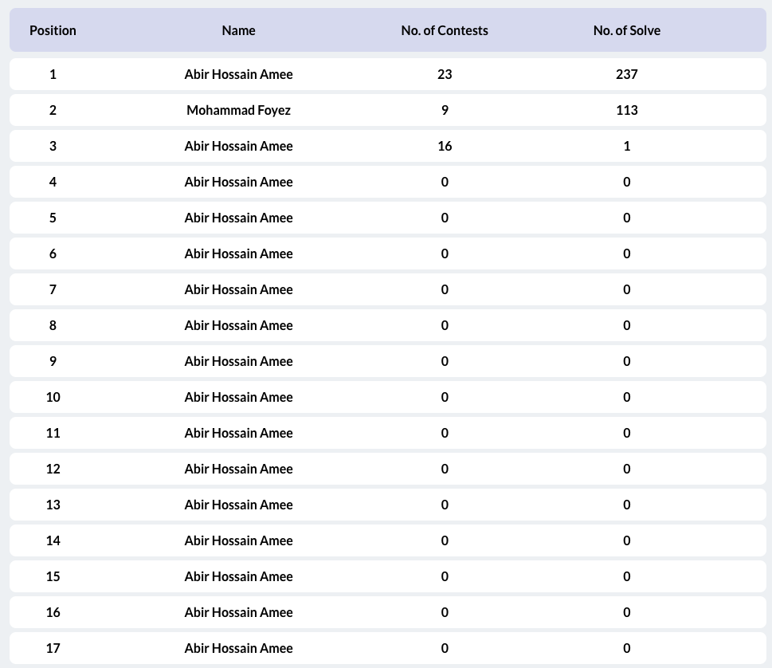
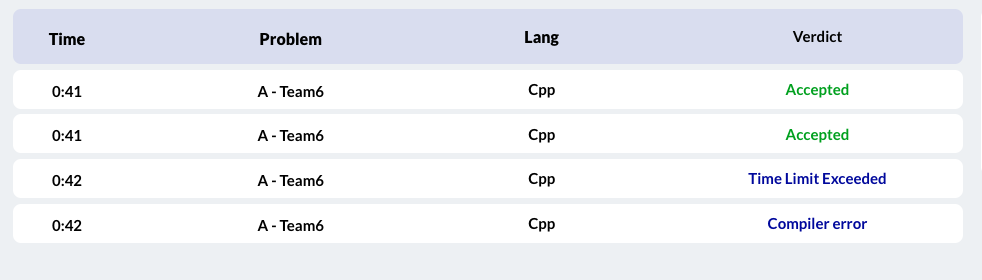
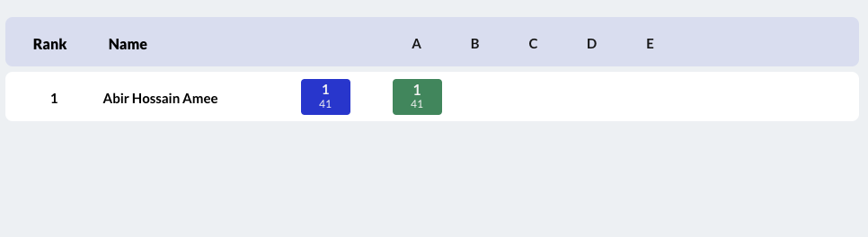
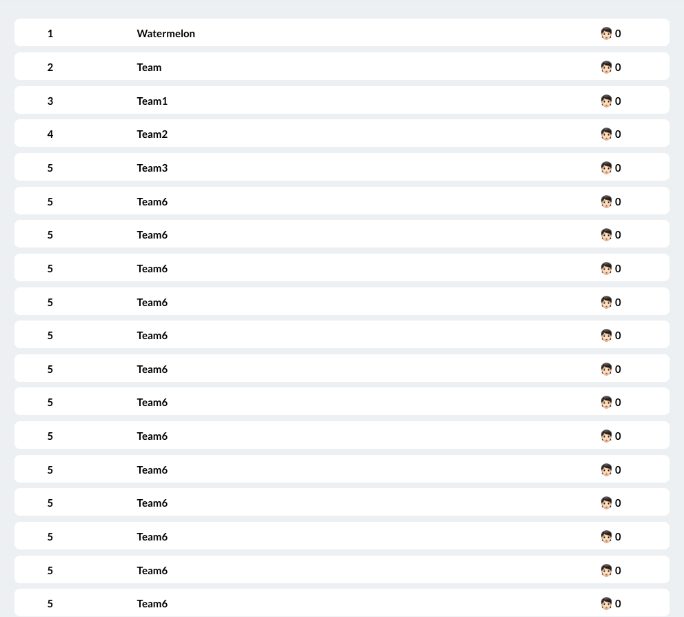
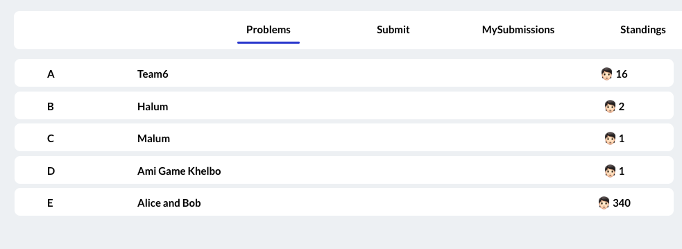
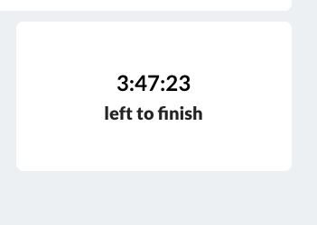
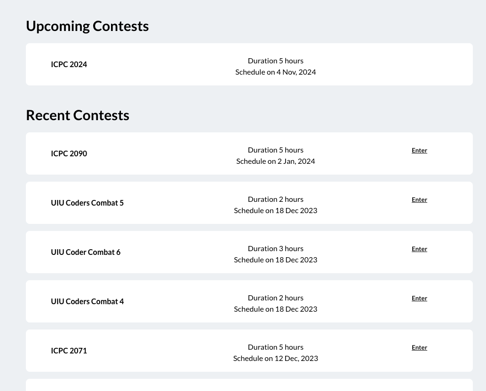
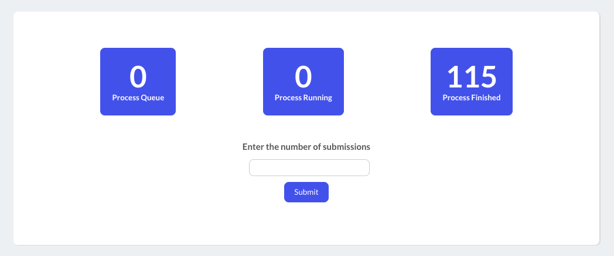

## Abir Hossain Amee

### Rank Filter

Rank is filtered with loadig the whole page. It's only load the specific part of the screen. 

### Mysubmissionns

Every submission of an user shown here. And it updated after a time inverval automically.

### Standings

Standing of a contest showed in this module. It updates with a interval of time without load the whole page again. 

## Sara Ferdous Khan

### All Problems

Fetching all the problems from server without loading the whole page.

### Problems Of a Contest

Fetching the problems of a contest from server without loading the whole page.

### Time Left

Fetching the time left to finish the contest without loading the whole page.

## Iftekhar Hossain

### Contest Page

Fetching all the contest information from the server

### Problem Statement

Fetching the problem statement and shown without loading the whole page

### Stress Test

Fetching the metrics of stress from server and showed without loading the whole page again. 

