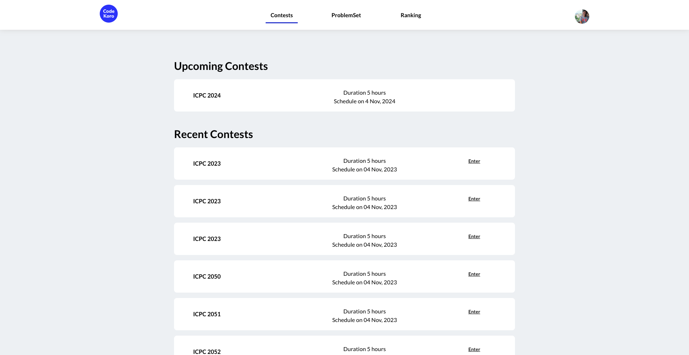
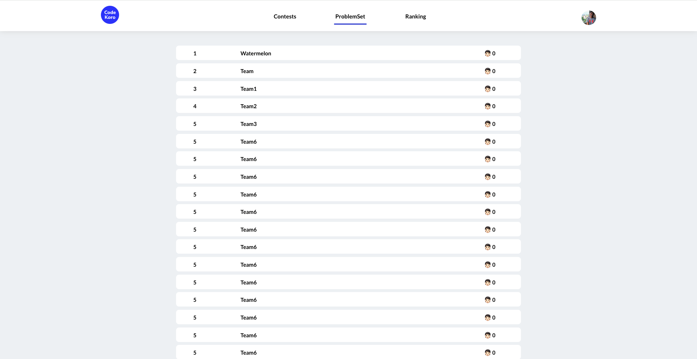
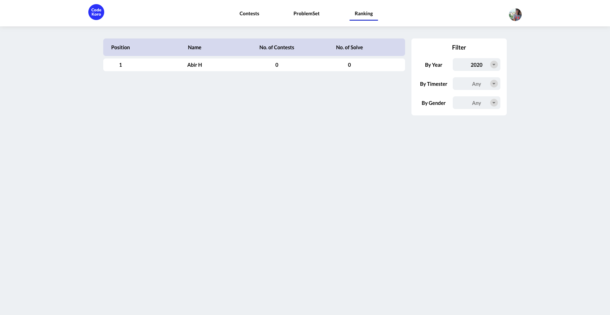
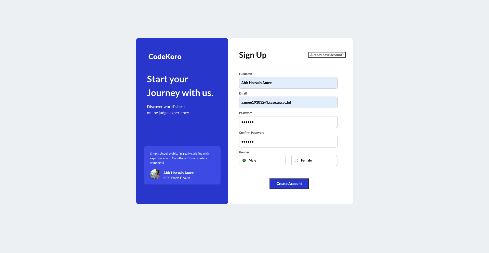
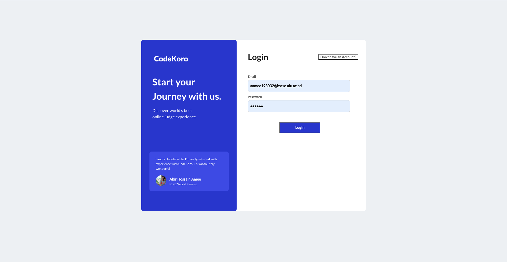
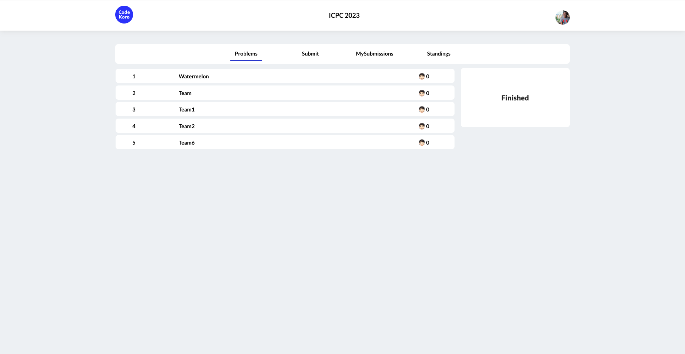
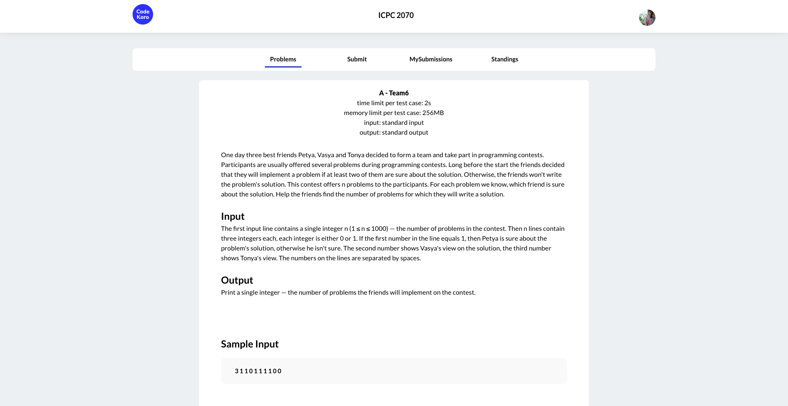
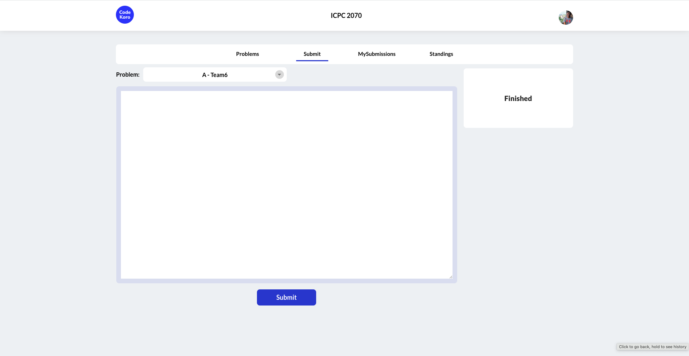
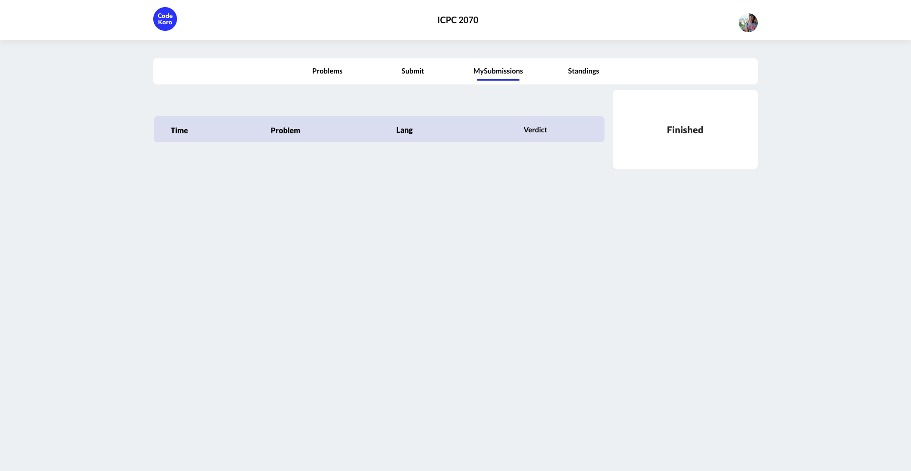
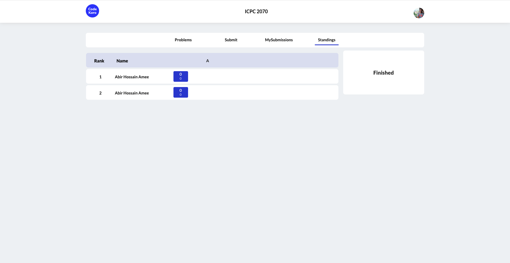

# Welcome to CodeKoro User Documentation
CodeKoro is an online judge meticulously crafted for the brilliant minds of the United International University (UIU) community. This cutting-edge platform is designed to elevate coding competitions, foster collaborative learning, and showcase the programming prowess of UIU students on the global stage.

## Home Page

You can access the Home page from here: [http://localhost:5173/](http://localhost:5173/)

Welcome to CodeKoros's dynamic home page, where the world of coding excellence unfolds before you. This user-friendly interface is intelligently divided into three key subparts, each catering to a distinct aspect of your coding journey: Contests, Problems, and Ranking.

### Contests:

Dive into the heart of competition with the "Contests" section. Discover a thrilling array of coding challenges, carefully curated to test and enhance your skills. From time-bound coding marathons to thematic contests, this section is where the UIU coding community comes alive. Stay tuned for announcements, register for upcoming contests, and embark on an exhilarating coding adventure.

### ProblemSet:

In the "ProblemSet" section, find a treasure trove of coding challenges designed to cater to all skill levels. Whether you're a novice coder looking to sharpen your basics or an experienced algorithm maestro seeking a new conquest, this section has something for everyone. Explore a wide range of problems, each accompanied by detailed explanations and interactive tutorials. CodeKoro is not just about contests; it's about continuous learning, and the Problems section is your gateway to mastery.

### Ranking:

Track your progress and witness the rise of coding stars in the "Ranking" section. This dynamic leaderboard showcases the real-time standings of participants in ongoing contests, providing an instant snapshot of the CodeKoros's competitive landscape. Strive for the top positions, celebrate your achievements, and benchmark your skills against peers. The Ranking section is not just about competition; it's a motivational tool, inspiring you to reach new coding heights.

## Authntication
### Sing up

Welcome to the gateway of endless coding possibilities – the CodeKoro Sign-Up Page. This is where your journey into the vibrant world of coding excellence begins. Our user-friendly and intuitive sign-up process ensures that joining the CodeKoro community is a smooth and enjoyable experience.

### Sign In

Effortlessly access the CodeKoro community with our streamlined Sign-In. Securely sign in using your email and password or opt for social authentication. Forgot your password? No worries – recovery is a click away. Once in, explore contests, track progress, and engage with the global coding community. Experience a user-friendly interface designed for efficiency. Elevate your coding journey – Sign In to CodeKoro today!

## CodeKoro Contest Arena

Welcome to the heart of CodeKoro, our Contest Arena! Immerse yourself in the thrill of coding competitions with four distinct subparts designed to make your experience seamless and xhilarating: Problems, Submit, My Submission, and Standings.

### Problems

Explore the diverse and intellectually stimulating world of coding challenges in the "Problems" section. Engage with carefully curated problem sets that cater to all skill levels. Each challenge is a gateway to honing your coding prowess, offering a unique opportunity to expand your knowledge and skills.

#### Problem Statemen

Welcome to the Problem Statement Page on CodeKoro, where the art of coding meets the precision of problem-solving. This dedicated page is the gateway to a world of challenges, providing participants with a comprehensive understanding of the coding puzzle at hand.

### Submit

Ready to showcase your coding finesse? Navigate to the "Submit" section, where you can effortlessly submit your solutions to the contest problems. Our user-friendly interface ensures a smooth submission process, allowing you to focus on what you do best—crafting elegant and efficient code solutions.

### My Submission

Keep track of your coding journey in the "My Submission" section. Access a comprehensive overview of your submitted solutions, monitor their status, and receive real-time feedback. Whether you're celebrating success or learning from challenges, this section is your personalized dashboard for tracking your progress through the contest.

### Standings

Experience the thrill of competition unfold in real-time with the "Standings" section. Witness the dynamic leaderboard, showcasing the ranking of participants as they navigate through the contest challenges. Stay updated on your position, celebrate achievements, and revel in the spirit of healthy competition.

