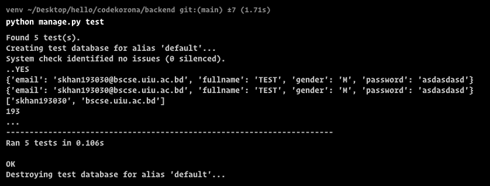
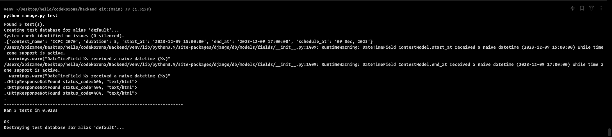
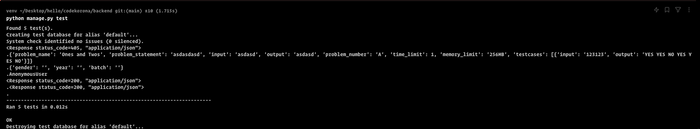

## Introduction
Unit testing is a fundamental aspect of CodeKoro's testing strategy. Each component of the system undergoes thorough unit testing to ensure that individual functions and modules work as intended. This includes testing the parser, compiler, code executor, and any other core components responsible for code evaluation.

### Sara Ferdous Khan
#### Test Create User
``` py
     email = "asdasd192032@uiu.bscse.ac.bd"
        fullname = "TEST"
        gender = "M"
        password = "asdasdasd"

        user = UserModel(email=email, fullname=fullname, gender=gender, password=password)
        user.save()

        self.assertEquals(user.email, email)
        self.assertEquals(user.fullname, fullname)
        self.assertEquals(user.gender, gender)
```

#### Test with no Auth
``` py
        client = APIClient(enforce_csrf_checks=True)
        response = client.get('http://127.0.0.1:8000/me/', format='json')
        self.assertFalse(response.data['success'])
```

#### Test with valid Sign Up
``` py
        def test_valid_sign_up(self):
        client = APIClient()
        response = client.post('http://127.0.0.1:8000/auth/signup/',
                               {'email': "skhan193030@bscse.uiu.ac.bd",
                                'fullname': "TEST",
                                'gender': "M",
                                'password': "asdasdasd"},
                               format='json')
        self.assertTrue(response.data['success'])
```


#### Test with invalid Sign in
``` py
        client = APIClient()
        response = client.post('http://127.0.0.1:8000/auth/signin/',
                               {'email': "0",
                                'password': "0"},
                               format='json')
        self.assertFalse(response.data['success'])
```

#### Test with incorrect passoword Sign in
``` py
        client = APIClient()
        response = client.post('http://127.0.0.1:8000/auth/signin/',
                               {'email': "skhan193030@bscse.uiu.ac.bd",
                                'password': "0"},
                               format='json')
        self.assertFalse(response.data['success'])
```
#### Test Result


### Abir Hosain Amee
#### Test Create Contest
``` py
        def test_create_contest(self):
            client = APIClient(enforce_csrf_checks=True)
            response = client.post('http://127.0.0.1:8000/contest/', {
                "contest_name": "ICPC 2070",
                "duration": 5,
                "start_at": "2023-12-09 15:00:00",
                "end_at": "2023-12-09 17:00:00",
                "schedule_at": "09 Dec, 2023"
            }, format='json')
            self.assertTrue(response.data['success'])
```

#### Test Time
``` py
        def test_time(self):
            client = APIClient()
            response = client.post('http://127.0.0.1:8000/contest/time/',
                                {'contest_id': 14},
                                format='json')
            print(response)
            self.assertTrue(response)
```

#### Test Process Analytics View
``` py
        def test_time(self):
            client = APIClient()
            response = client.post('http://127.0.0.1:8000/contest/time/',
                                {'contest_id': 14},
                                format='json')
            print(response)
            self.assertTrue(response)
```

#### Test Standings
``` py
        def test_standings(self):
            client = APIClient()
            response = client.post('http://127.0.0.1:8000/contest/standings/',
                                {'contest_id': 14},
                                format='json')
            print(response)
            self.assertTrue(response)
```

#### Test Get All Contests
``` py
        def test_all_contests(self):
        client = APIClient()
        response = client.get('http://127.0.0.1:8000/contest/all/',
                              format='json')
        self.assertTrue(response)
```

#### Test Result


### Iftekhar Hossain 

#### Test Create Problem
``` py
        def test_create_problem(self):
            client = APIClient(enforce_csrf_checks=True)
            response = client.post('http://127.0.0.1:8000/create-problem/', {
                "problem_name": "Ones and Twos",
                "problem_statement": "asdasdasd",
                "input": "asdasd",
                "output": "asdasd",
                "problem_number": "A",
                "time_limit": 1,
                "memory_limit": "256MB",
                "testcases": [
                    {
                        "input": "123123",
                        "output": "YES YES NO YES YES NO"
                    }
                ]
            }, format='json')
            self.assertTrue(response.data['success'])
```

#### Test Get Specific Problem
``` py
        def test_get_specific_problem(self):
            client = APIClient()
            response = client.post('http://127.0.0.1:8000/problem-contest/',
                                {'id': 14},
                                format='json')
            print(response)
            self.assertTrue(response)
```


#### Test Get All Problem
``` py
        def test_get_specific_problem(self):
            client = APIClient()
            response = client.post('http://127.0.0.1:8000/problem-contest/',
                                {'id': 14},
                                format='json')
            print(response)
            self.assertTrue(response)
```

#### Test Get TestCases
``` py
        def test_get_test_cases(self):
            client = APIClient()
            response = client.post('http://127.0.0.1:8000/problem/testcases/',
                                {'id': 41},
                                format='json')
            print(response)
            self.assertTrue(response)
```

#### Test Get Rank
``` py
        def test_get_rank(self):
            client = APIClient()
            response = client.post('http://127.0.0.1:8000/rank/', {'gender': '', 'year': '', 'batch': ''},
                                format='json')
            self.assertTrue(response)
```

#### Test Result



